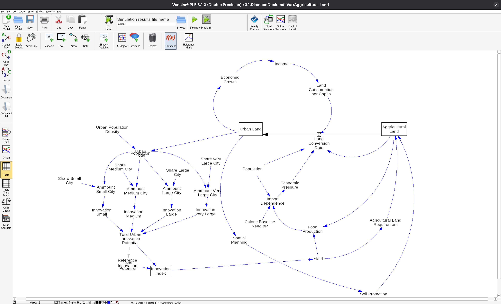

- DONE MAILS RAUSLASSEN
  background-color:: red
- GOD DAMMIT!!!!!!! LOGISCH
	- 
	- Fehlerursache: Stocks sind nicht konsistent an denselben Flow gekoppelt
	  
	  **Problem**
	  
	  Im Modell waechst `Urban Land`, ohne dass `Agricultural Land` im gleichen Ausmass sinkt. Das bedeutet: Die Flaeche wird im Modell nicht erhalten.
	  
	  Die Ursache ist, dass `Urban Land` und `Agricultural Land` **nicht mit exakt demselben Flow** verbunden sind.
	  
	  Aktuell gilt sinngemaess:
	  
	  
	  Urban Land = INTEG(Land Conversion Rate, ...)
	  Agricultural Land = INTEG(-Land Conversion Rate * Zusatzfaktoren, ...)
	  
	  
	  Damit bekommt `Urban Land` die volle `Land Conversion Rate`, waehrend `Agricultural Land` nur eine skaliert-veraenderte Version davon verliert.
	  
	  **Folge**
	  
	  Es wird effektiv Flaeche "erzeugt", weil:
	  
	  
	  `Urban Land` stark zunimmt
	  
	  
	  `Agricultural Land` nur schwach abnimmt
	  
	  Das verletzt die Grundlogik eines Stock-Flow-Uebergangs.
	  
	  ---
	  
	  Korrektur
	  
	  **Regel**
	  
	  Wenn ein Flow Flaeche von einem Stock in einen anderen verschiebt, muss auf beiden Seiten **derselbe Flow** wirken:
	  
	  ```
	  Urban Land = INTEG(Land Conversion Rate, Initial Urban Land)
	  Agricultural Land = INTEG(-Land Conversion Rate, Initial Agricultural Land)
	  ```
	  
	  **Wichtig**
	  
	  Alle modulierenden Faktoren wie z. B.
	  
	  
	  `Agricultural Land Requirement`
	  
	  `Soil Protection`
	  
	  
	  `Economic Pressure`
	  
	  gehoeren **in die Gleichung von `Land Conversion Rate`**, nicht in die Stock-Gleichung.
	  
	  Also:
	  
	  
	  Land Conversion Rate = Basisrate * Einflussfaktor1 * Einflussfaktor2 * ...
	  Urban Land = INTEG(Land Conversion Rate, ...)
	  Agricultural Land = INTEG(-Land Conversion Rate, ...)
	  
	  
	  ---
	  
	  
	  Merksatz
	  
	  **Stocks sollen nur integrieren. Die Dynamik und alle Steuerungseffekte gehoeren in den Flow.**
	-